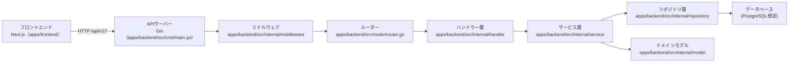

## バックエンドアーキテクチャ概要

このドキュメントでは、`cinetag` のバックエンド（Gin ベース）のアーキテクチャとフォルダ構成、および各レイヤーの責務をまとめます。

### 技術スタック

- **言語**: Go
- **Webフレームワーク**: Gin (`github.com/gin-gonic/gin`)
- **構成**: `apps/backend` 配下に配置されたサービスとして、フロントエンド（Next.js）から呼び出される API を提供

---

## ディレクトリ構成

```text
apps/backend/
├── src/
│   ├── cmd/
│   │   ├── main.go              # API サーバーのエントリーポイント
│   │   └── migrate/
│   │       └── main.go          # マイグレーション専用エントリーポイント
│   ├── internal/
│   │   ├── handler/             # ハンドラー（プレゼンテーション層）
│   │   ├── service/             # ビジネスロジック層
│   │   ├── repository/          # 永続化層（DB アクセス）※将来追加想定
│   │   ├── model/               # ドメインモデル
│   │   ├── middleware/          # カスタムミドルウェア
│   │   └── config/              # 設定読み込み       ※将来追加想定
│   └── router/
│       └── router.go            # ルーティング定義を一元管理
└── ...
```

---

## アーキテクチャ構成図



---

## レイヤー構造と責務

### 1. `src/cmd/`（エントリーポイント）

- **責務**
  - アプリケーション起動処理
  - ポート番号やモードなどの基本設定
  - ルーターの初期化とサーバー起動

将来的には、`router/router.go` にルーティング定義を切り出し、`cmd/main.go` では「設定読み込み」「依存関係の組み立て」「ルーター初期化」のみに責務を絞ることを想定しています。

### 2. `src/internal/handler/`（ハンドラー層）

- **責務**
  - HTTP リクエスト/レスポンスの変換
  - URL パラメータやクエリ、ボディのバリデーション
  - Service 層の呼び出しと、結果を HTTP レスポンスとして返却
- **ポイント**
  - ビジネスロジックは極力 `service` 層へ委譲し、ハンドラーは薄く保つ
  - Gin の `*gin.Context` に依存するのはこの層までに留める

### 3. `src/internal/service/`（ビジネスロジック層）

- **責務**
  - アプリケーションのビジネスルールを実装
  - 複数の Repository を組み合わせたユースケースの実現
  - トランザクション制御（必要に応じて）
- **ポイント**
  - Gin や DB の具体的な実装からは切り離し、インターフェースに依存させる
  - 単体テストが書きやすいようにインターフェースベースの設計にする

### 4. `src/internal/repository/`（永続化層）

- **責務**
  - データベースや外部ストレージへのアクセス
  - ORM や SQL クエリの実装
- **ポイント**
  - 上位層（service）はインターフェース経由でアクセスし、具体的な DB 実装に依存しない
  - 変更しやすいように、テーブル/集約ごとに Repository を分割する

### 5. `src/internal/model/`（ドメインモデル）

- **責務**
  - ドメインオブジェクト（例: User, Movie, Category など）の定義
  - ビジネスルールに紐づくメソッドやバリデーション

---

## ルーティングの設計方針

- すべての API は共通プレフィックス `/api/v1` 配下に配置
- 機能ごとにルートグループを切る
  - 例: `/api/v1/movies`, `/api/v1/users`, `/api/v1/categories` など
- 実装は `router/router.go` に集約し、ハンドラーのバインドのみを行う

---

## 設定と環境変数

- ポート番号は `PORT` 環境変数から取得し、未設定時は `8080` をデフォルトとする
- 将来的には、以下のような設定を `internal/config` にまとめることを想定
  - データベース接続情報
  - 外部 API キー
  - ログレベル など

---
