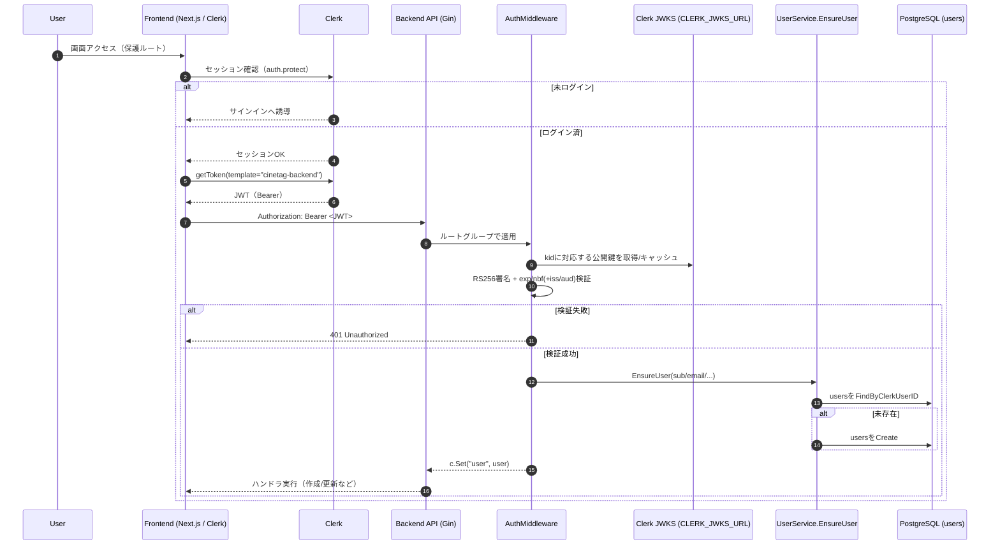
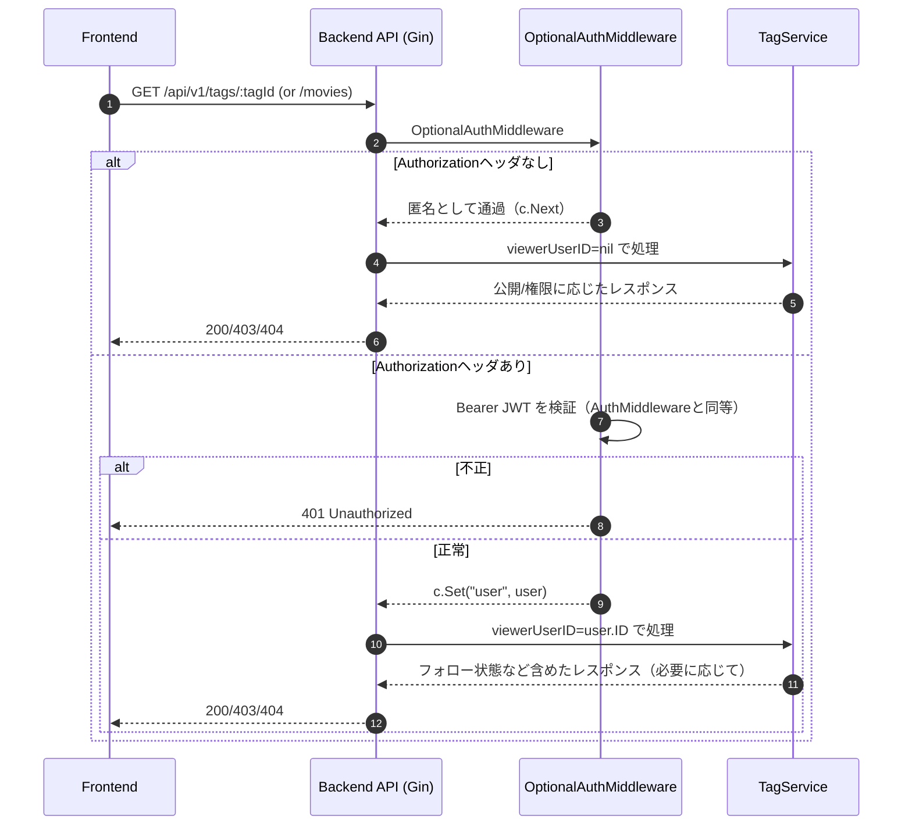
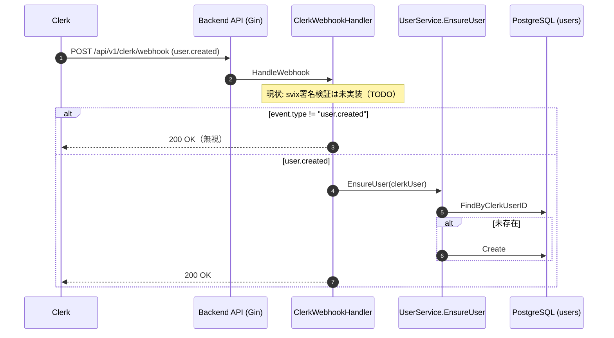

## 認証・ユーザー管理アーキテクチャ設計書

### 1. 概要

- **目的**
  - `cinetag` における **認証（Clerk）とバックエンドの `users` テーブル管理** の役割分担・データフローを定義する。

---

### 2. コンポーネント構成

#### 2.1 フロントエンド（Next.js / Clerk）

- `apps/frontend`
- 使用ライブラリ: `@clerk/nextjs`
- 主な責務:
  - サインアップ / サインイン UI (`<SignUp />`, `<SignIn />`)
  - セッション・トークン管理（Clerk がブラウザ側で実施）
  - 認証済みユーザーとしてバックエンド API を呼び出す（`Authorization` ヘッダ or Cookieベース）

#### 2.2 認証基盤（Clerk）

- 外部IDプロバイダとして Clerk を利用。
- 主な責務:
  - ユーザー登録、ログイン、パスワードリセット等のフロー全般
  - ユーザープロフィール（メールアドレス・表示名・アイコン画像など）の保持
  - Webhook によるユーザーイベントの通知（`user.created`, `user.updated` など）
  - バックエンド向けの検証可能なトークン（JWT 等）の発行

#### 2.3 バックエンド（Gin / Go）

- `apps/backend`
- 主な責務:
  - 認証済みユーザーに対する API 提供
  - `users` / `tags` / `tag_movies` / `tag_followers` / `movie_cache` などアプリ固有データの管理
  - **Clerk のユーザーIDと、アプリ内部のユーザー（`users` テーブル）との紐付け**

---

### 3. 認証・ユーザー同期フロー（全体像）

#### 3.1 サインアップフロー（Clerk）

1. ユーザーはフロントエンドの `/(auth)/sign-up` で `<SignUp />` コンポーネントを通じて登録する。
2. サインアップ完了後、Clerk 側にユーザーが作成される。
3. Clerk は設定された Webhook エンドポイントに `user.created` イベントを送信する（※詳細は後述）。
4. さらに、ユーザーがアプリのページにアクセスすると、Clerk セッションが有効化され、バックエンド API へ送るトークンが利用可能になる。

#### 3.2 バックエンドでの「ユーザー存在保証」フロー

本設計では **二段構え** で `users` を同期する：

1. **Webhook（早期同期・ベストエフォート）**
   - Clerk の `user.created` Webhook を `POST /api/v1/clerk/webhook` で受信し、`users` に行を作成する。
   - 失敗した場合は Clerk 側のリトライに期待しつつ、後述の Lazy Sync で補完する。

2. **Lazy Sync（初回アクセス時同期・確実な保証）**
   - 認証必須 API にアクセスするたびに、Gin ミドルウェア（`AuthMiddleware`）で Clerk トークンを検証し、
   - 検証済みの Clerk ユーザー情報をもとに `UserService.EnsureUser` を実行し、`users` に必ず行が存在するようにする。

これにより、
- Webhook が失敗しても、**ユーザーが初めてバックエンドを叩いたタイミングで `users` が作成される** ため、
- 実運用上の不整合をほぼゼロにできる。

---

### 4. バックエンド API の認証ポリシー

#### 4.1 認証が必要なエンドポイント

方針: 「ユーザー固有のデータを書き換える / 閲覧する API」は **すべて `AuthMiddleware` を通す**。

#### 4.2 認証方法（Clerk トークン検証）

- フロントエンドでは、Clerk が管理するセッションを通じて、HTTP リクエストにトークンを付与する。
  - 例: `Authorization: Bearer <JWT>` ヘッダ、または Clerk がセットする Cookie
- バックエンドでは、**すべての認証必須ルートに `AuthMiddleware` を適用**し、以下を行う:
  1. リクエストからトークンを取り出す（`Authorization` ヘッダ or Cookie）。
  2. Clerk の公開鍵または公式 SDK を用いてトークンを検証する。
     - 署名
     - 有効期限
     - 対象オーディエンス（`aud`）や発行者（`iss`） など
  3. 検証に成功した場合のみ、後続の処理（ユーザー同期・ハンドラー）に進む。
  4. 失敗した場合は `401 Unauthorized` を返し、ハンドラーは一切実行しない。

> 実装メモ（環境変数）:
> - `CLERK_JWKS_URL`: **必須**。Clerk の JWKS エンドポイント（例: `https://<your-domain>/.well-known/jwks.json`）
> - `CLERK_ISSUER`: 任意。設定時は `iss` を検証する
> - `CLERK_AUDIENCE`: 任意。設定時は `aud` を検証する

このように、**バックエンド API へのリクエストは、「AuthMiddleware を通過したものだけが認証済み扱いになる」** という明確なルールを設ける。

### 5. 詳細設計

#### 5.1 Webhook による早期同期（`user.created`）

- **エンドポイント**: `POST /api/v1/clerk/webhook`
- **処理概要**
  1. `svix` 署名ヘッダを検証し、Clerk からの正当なリクエストであることを確認。
  2. ボディから `user.created` イベントをパースし、必要な情報を抽出。
     - `id`（Clerk user ID） → `clerk_user_id`
     - `primary_email_address` → `email`
     - `username` / `first_name` / `last_name` → `username` / `display_name`
     - `image_url` → `avatar_url`
  3. `clerk_user_id` で `users` を検索し、存在しなければ新規作成（idempotent な実装にする）。
  4. 成功時は `200 OK`、一時的な障害時は `5xx` を返し Clerk にリトライさせる。

- **注意点**
  - Webhook は到達保証が完全ではないため、「**これだけに依存しない**」。
  - あくまで「**できるだけ早く `users` を作っておくための最適化**」という扱い。

#### 5.2 AuthMiddleware（認証＋ユーザー存在保証）

- **ミドルウェア名**: `AuthMiddleware`
- **責務（A: 認証）**
  1. リクエストから Clerk トークンを取り出し、Clerk SDK または公開鍵で検証する。
  2. 検証済みトークンから、Clerk ユーザー情報（`ClerkUserInfo`）を取得する。
  3. 検証に失敗した場合は `401 Unauthorized` を返し、後続のハンドラーを実行しない。
- **責務（B: ユーザー同期）**
  4. `UserService.EnsureUser(ctx, clerkUser)` を呼び出して `users` 行の存在を保証する。
  5. 結果の `*model.User` を `gin.Context` に格納（`c.Set("user", user)`）し、以降のハンドラーから利用できるようにする。

- **`UserService.EnsureUser` の責務**
  - `clerk_user_id` で `users` を検索。
  - あればそのまま返す。
  - なければ、Clerk 情報を元に新規作成し、作成したユーザーを返す。
  - DBエラーは呼び出し元に返却。

- **ルーティングでの適用例**
  - `/api/v1` のうち「認証必須」のルートグループに `AuthMiddleware` を付与する。
  - 「完全公開」のエンドポイント（ヘルスチェック、パブリックフィードなど）はミドルウェア無し。

---

### 6. 認証・認可フロー図（現状実装）

以下の図は **現状のコード実装**（`apps/frontend/src/middleware.ts`, `apps/backend/src/internal/middleware/*`, `apps/backend/src/router/router.go`）に合わせて整理したものです。

#### 6.1 ログイン → 認証必須API呼び出し（POST/PATCH など）

#### 6.2 Optional認証（閲覧系: タグ詳細/タグ内映画）

#### 6.3 Webhook（user.created）による早期同期

#### 6.4 現状実装に関する注意点（設計との差分）

- **Webhookの署名検証（svix）は未実装**: 現状はpayloadをそのまま受けて同期します（セキュリティ上は要対応）。
- **トークン受け渡しはAuthorizationヘッダ（Bearer）前提**: バックエンドの`AuthMiddleware`/`OptionalAuthMiddleware`はCookie認証は扱いません。
- **フロントの閲覧系GETは現状トークン未付与**: そのため「ログイン中ユーザーとしての文脈（viewerUserID）」が必要な情報は、現状は返せない/返しづらい構造です。

### 8. 今後の拡張候補

- **複数プロバイダ対応**
  - 将来的に Clerk 以外のIDプロバイダを併用する場合は、`user_auth_providers` テーブルを定義し、`users` とは別テーブルで紐付ける。

---