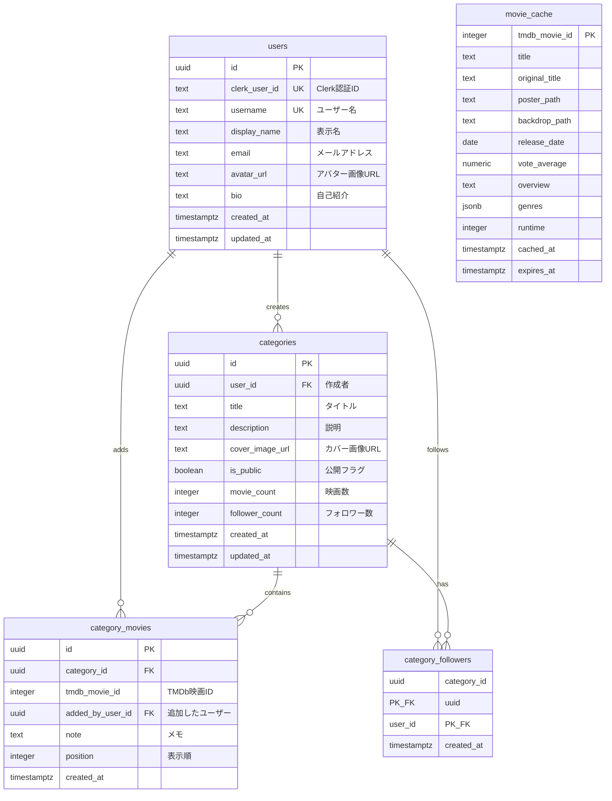

# 映画カテゴリ共有サービス - テーブル定義

## ER図

---

## テーブル一覧

| テーブル名 | 説明 | 主キー |
|-----------|------|--------|
| `users` | ユーザー情報 | `id` (UUID) |
| `categories` | 映画カテゴリ（プレイリスト） | `id` (UUID) |
| `category_movies` | カテゴリと映画の関連 | `id` (UUID) |
| `category_followers` | カテゴリのフォロー関係 | `(category_id, user_id)` |
| `movie_cache` | TMDb映画情報キャッシュ | `tmdb_movie_id` (INTEGER) |

---

## カラム詳細

### users（ユーザー）

| カラム名 | 型 | NULL | デフォルト | 説明 |
|---------|-----|------|-----------|------|
| `id` | UUID | NO | `gen_random_uuid()` | ユーザーID |
| `clerk_user_id` | TEXT | NO | - | Clerk認証ID（一意） |
| `username` | TEXT | NO | - | ユーザー名（一意） |
| `display_name` | TEXT | NO | - | 表示名 |
| `email` | TEXT | NO | - | メールアドレス |
| `avatar_url` | TEXT | YES | - | アバター画像URL |
| `bio` | TEXT | YES | - | 自己紹介文 |
| `created_at` | TIMESTAMPTZ | NO | `CURRENT_TIMESTAMP` | 作成日時 |
| `updated_at` | TIMESTAMPTZ | NO | `CURRENT_TIMESTAMP` | 更新日時 |

### categories（カテゴリ）

| カラム名 | 型 | NULL | デフォルト | 説明 |
|---------|-----|------|-----------|------|
| `id` | UUID | NO | `gen_random_uuid()` | カテゴリID |
| `user_id` | UUID | NO | - | 作成者のユーザーID |
| `title` | TEXT | NO | - | タイトル（1-100文字） |
| `description` | TEXT | YES | - | 説明（最大500文字） |
| `cover_image_url` | TEXT | YES | - | カバー画像URL |
| `is_public` | BOOLEAN | NO | `true` | 公開フラグ |
| `movie_count` | INTEGER | NO | `0` | 映画数（非正規化） |
| `follower_count` | INTEGER | NO | `0` | フォロワー数（非正規化） |
| `created_at` | TIMESTAMPTZ | NO | `CURRENT_TIMESTAMP` | 作成日時 |
| `updated_at` | TIMESTAMPTZ | NO | `CURRENT_TIMESTAMP` | 更新日時 |

### category_movies（カテゴリ内映画）

| カラム名 | 型 | NULL | デフォルト | 説明 |
|---------|-----|------|-----------|------|
| `id` | UUID | NO | `gen_random_uuid()` | レコードID |
| `category_id` | UUID | NO | - | カテゴリID |
| `tmdb_movie_id` | INTEGER | NO | - | TMDb映画ID |
| `added_by_user_id` | UUID | NO | - | 追加したユーザーID |
| `note` | TEXT | YES | - | メモ（最大280文字） |
| `position` | INTEGER | NO | `0` | 表示順 |
| `created_at` | TIMESTAMPTZ | NO | `CURRENT_TIMESTAMP` | 追加日時 |

### category_followers（フォロー）

| カラム名 | 型 | NULL | デフォルト | 説明 |
|---------|-----|------|-----------|------|
| `category_id` | UUID | NO | - | カテゴリID（複合PK） |
| `user_id` | UUID | NO | - | ユーザーID（複合PK） |
| `created_at` | TIMESTAMPTZ | NO | `CURRENT_TIMESTAMP` | フォロー日時 |

### movie_cache（映画キャッシュ）

| カラム名 | 型 | NULL | デフォルト | 説明 |
|---------|-----|------|-----------|------|
| `tmdb_movie_id` | INTEGER | NO | - | TMDb映画ID（PK） |
| `title` | TEXT | NO | - | 映画タイトル |
| `original_title` | TEXT | YES | - | 原題 |
| `poster_path` | TEXT | YES | - | ポスター画像パス |
| `backdrop_path` | TEXT | YES | - | 背景画像パス |
| `release_date` | DATE | YES | - | 公開日 |
| `vote_average` | NUMERIC(3,1) | YES | - | 評価スコア |
| `overview` | TEXT | YES | - | あらすじ |
| `genres` | JSONB | YES | - | ジャンル |
| `runtime` | INTEGER | YES | - | 上映時間（分） |
| `cached_at` | TIMESTAMPTZ | NO | `CURRENT_TIMESTAMP` | キャッシュ作成日時 |
| `expires_at` | TIMESTAMPTZ | NO | `+7 days` | 有効期限 |

---

## トリガー一覧

| トリガー名 | テーブル | イベント | 用途 |
|-----------|---------|---------|------|
| `update_users_updated_at` | users | BEFORE UPDATE | updated_at自動更新 |
| `update_categories_updated_at` | categories | BEFORE UPDATE | updated_at自動更新 |
| `trigger_update_category_movie_count` | category_movies | AFTER INSERT/DELETE | movie_count更新 |
| `trigger_update_category_follower_count` | category_followers | AFTER INSERT/DELETE | follower_count更新 |

---

## 制約一覧

| テーブル | 制約名 | 種類 | 内容 |
|---------|--------|------|------|
| users | `users_clerk_user_id_key` | UNIQUE | clerk_user_idの一意性 |
| users | `users_username_key` | UNIQUE | usernameの一意性 |
| categories | `categories_title_length` | CHECK | タイトル1-100文字 |
| categories | `categories_description_length` | CHECK | 説明500文字以下 |
| categories | `categories_movie_count_positive` | CHECK | movie_count >= 0 |
| categories | `categories_follower_count_positive` | CHECK | follower_count >= 0 |
| category_movies | `category_movies_unique` | UNIQUE | (category_id, tmdb_movie_id)の一意性 |
| category_movies | `category_movies_note_length` | CHECK | メモ280文字以下 |
| category_movies | `category_movies_position_positive` | CHECK | position >= 0 |

---