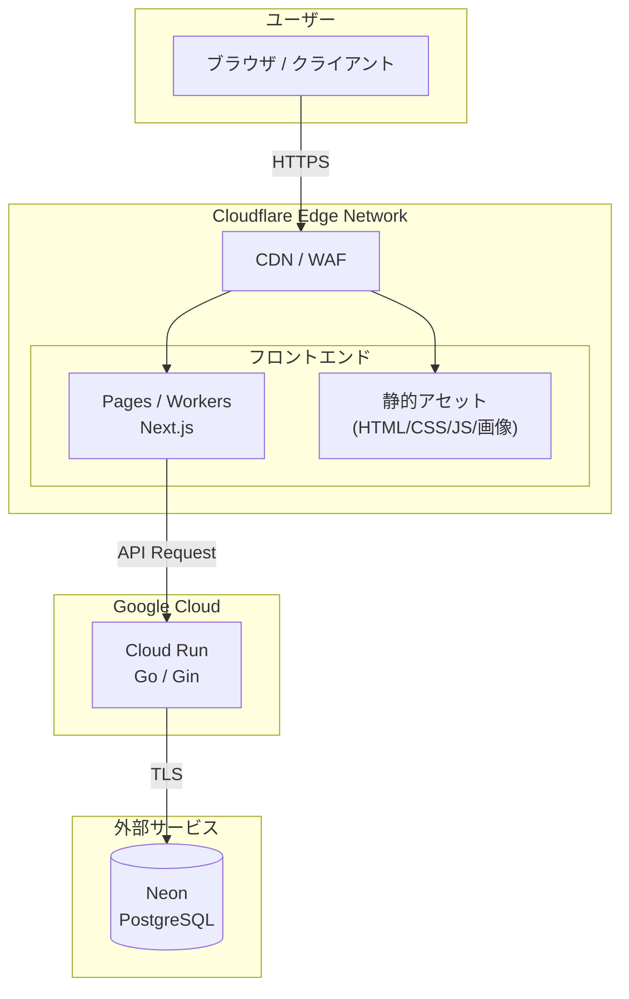
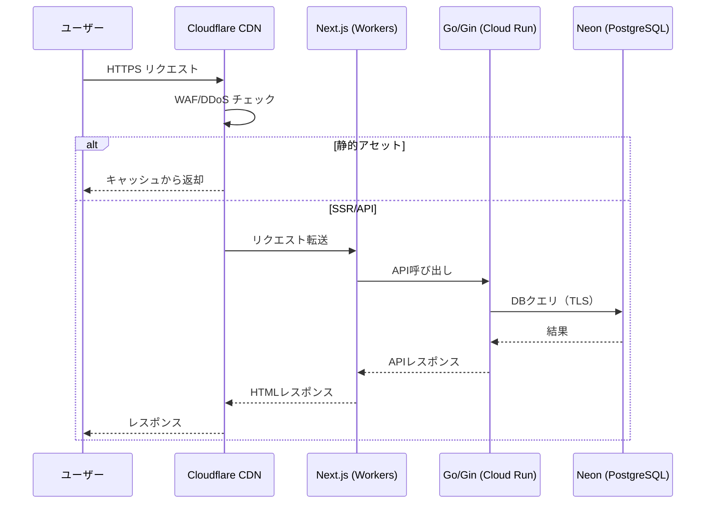
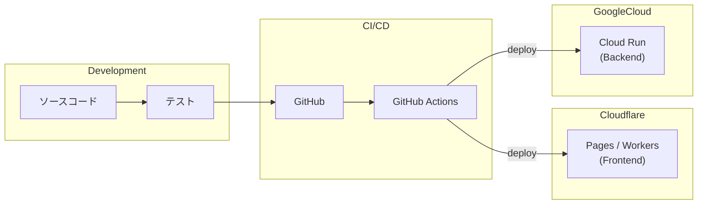

## 1. 概要

### 1.1 目的

本ドキュメントは、`cinetag`のインフラ構成について定義する。

### 1.2 システム概要

- **フロントエンド**: Next.js によるSSR/SSG対応Webアプリケーション
- **バックエンド**: Go (Gin) によるREST APIサーバー
- **データベース**: PostgreSQL

---

## 3. システム構成図



---

## 4. 使用サービス一覧

| レイヤー | サービス | 用途 | 備考 |
|----------|----------|------|------|
| CDN/セキュリティ | Cloudflare CDN | コンテンツ配信、DDoS対策 | 自動適用 |
| フロントエンド | Cloudflare Pages / Workers | Next.js ホスティング | SSR/SSG対応 |
| バックエンド | Google Cloud Run | Go/Gin APIサーバー | コンテナ実行（マネージド） |
| データベース | Neon | PostgreSQL | 外部サービス |

---

## 5. コンポーネント詳細

### 5.1 フロントエンド（Next.js）

#### 実行環境

| 項目 | 仕様 |
|------|------|
| プラットフォーム | Cloudflare Pages / Workers |
| フレームワーク | Next.js |
| レンダリング | SSR / SSG / ISR |
| デプロイ方式 | Github workflow (Wrangler CLI) |

#### リソース制限

| 項目 | 制限値 |
|------|--------|
| リクエスト | 1,000万/月（Paid Plan含む） |
| CPU時間 | 30ms/リクエスト（最大5分） |
| メモリ | 128MB |
| 静的アセット | 無制限 |

**参考（公式）**:
- [Cloudflare Pages platform limits](https://developers.cloudflare.com/pages/platform/limits/)
- [Cloudflare Workers platform limits](https://developers.cloudflare.com/workers/platform/limits/)

### 5.2 バックエンド（Go/Gin）

#### 実行環境

| 項目 | 仕様 |
|------|------|
| プラットフォーム | Google Cloud Run |
| 言語 | Go |
| フレームワーク | Gin |
| コンテナ形式 | Docker |
| デプロイ方式 | GitHub Actions |

#### 制約事項

| 項目 | 内容 |
|------|------|
| ディスク | 揮発性（コンテナの一時領域） |
| コールドスタート | あり（min instances が 0 の場合） |
| リクエスト制限 | タイムアウト / 同時実行数 / リクエストサイズ等の上限がある（詳細は公式ドキュメント参照） |
| スケーリング | 最小/最大インスタンス数やクォータ上限がある（詳細は公式ドキュメント参照） |

**参考（公式）**:
- [Cloud Run quotas / limits](https://cloud.google.com/run/quotas)
- [Cloud Run container contract](https://cloud.google.com/run/docs/container-contract)

### 5.3 データベース（Neon / PostgreSQL）

#### 外部サービス

| サービス | 特徴 | 無料枠 | 有料プラン |
|----------|------|--------|-----------|
| Neon | サーバーレス、オートスケール | 0.5GB, 190時間/月 | $19/月〜 |

#### 接続設定

| 項目 | 値 |
|------|-----|
| プロトコル | PostgreSQL (TCP) |
| ポート | 5432（標準） |
| SSL | 必須 |
| 接続方式 | Cloud Run から Neon に直接接続（TLS） |

#### 制約事項

| 項目 | 内容 |
|------|------|
| 接続数/性能 | プランやコンピュートサイズにより上限・性能特性が変わる（詳細は公式ドキュメント参照） |
| 拡張機能 | 利用できる Postgres 拡張機能に制約がある（詳細は公式ドキュメント参照） |
| 互換性 | 一部のPostgres設定/機能に互換性・制約がある（詳細は公式ドキュメント参照） |

**参考（公式）**:
- [Neon Docs](https://neon.com/docs)
- [Postgres compatibility (Neon)](https://neon.com/docs/reference/compatibility)
- [Supported Postgres extensions (Neon)](https://neon.com/docs/extensions/pg-extensions)

---

## 6. ネットワーク構成

### 6.1 通信フロー



### 6.2 エンドポイント設計

| エンドポイント | 用途 | 処理先 |
|----------------|------|--------|
| `/*` | フロントエンド | Pages/Workers |
| `/_next/static/*` | 静的アセット | CDNキャッシュ |
| `/api/*` | バックエンドAPI | Cloud Run |

### 6.3 DNS設定

| レコード | タイプ | 値 | Proxy |
|----------|--------|-----|-------|
| @ | CNAME | `<project>.pages.dev` | ON |
| www | CNAME | `<project>.pages.dev` | ON |
| api | CNAME | `<cloud-run-domain or custom-domain>` | ON（推奨） |

---

## 7. セキュリティ

### 7.1 通信セキュリティ

| 項目 | 対策 |
|------|------|
| HTTPS | Cloudflare自動SSL/TLS（強制） |
| TLSバージョン | TLS 1.2以上 |
| HSTS | 有効化推奨 |

### 7.2 アプリケーションセキュリティ

| 項目 | 対策 |
|------|------|
| DDoS対策 | Cloudflare標準機能 |
| WAF | Cloudflareマネージドルール |
| Bot対策 | Bot Management（オプション） |
| Rate Limiting | Workers Rate Limiting |

### 7.3 データベースセキュリティ

| 項目 | 対策 |
|------|------|
| 接続暗号化 | SSL必須 |
| 認証 | データベースユーザー認証 |
| IP制限 | Neon 側で可能な範囲で制限（必要に応じて） |
| シークレット管理 | Google Secret Manager / GitHub Actions Secrets（デプロイ経路に応じて） |

### 7.4 シークレット管理

```bash
# 例: Cloud Run 実行環境の環境変数として注入（gcloud）
# （実運用では Secret Manager 参照を推奨）
gcloud run services update <service-name> \
  --region <region> \
  --set-env-vars DATABASE_URL="<neon-connection-string>"
```

---

## 8. 監視・ログ

### 8.1 標準監視項目

| 項目 | ツール | 保持期間 |
|------|--------|----------|
| Workersメトリクス | Cloudflare Dashboard | 30日 |
| Cloud Run メトリクス | Google Cloud Monitoring | 構成に依存 |
| リクエストログ | Workers Logs | 7日（Paid） |
| エラーログ | Cloud Run Logs（Cloud Logging） | 構成に依存 |

### 8.2 アラート設定（推奨）

| 条件 | 閾値 | アクション |
|------|------|------------|
| エラー率 | > 1% | メール通知 |
| レイテンシ | > 3秒 | メール通知 |
| CPU使用率 | > 80% | スケール検討 |

---

## 9. デプロイメント

### 9.1 デプロイフロー



### 9.2 デプロイコマンド

```bash
# フロントエンドデプロイ
npm run build
#
# ※ Cloudflare 向けは `apps/frontend` の OpenNext（`npm run deploy`）を使用する運用を推奨
# npm run deploy

# バックエンドデプロイ
# 例: Cloud Run へコンテナをデプロイ（Artifact Registry/Cloud Build 等は運用に合わせて選定）
gcloud run deploy <service-name> \
  --source . \
  --region <region>
```

### 9.3 環境分離

| 環境 | ブランチ | URL |
|------|----------|-----|
| 開発 | develop | `dev.<project>.pages.dev` |
| ステージング | staging | `staging.<project>.pages.dev` |
| 本番 | main | `<custom-domain>` |

> CI/CD の詳細（品質ゲート、secrets、マイグレーション運用、ロールバック）は `docs/cicd.md` を参照してください。

---

## 10. 料金見積もり

### 10.1 Cloudflare料金

#### 固定費

| 項目 | 月額 |
|------|------|
| Workers Paid Plan | $5 |

#### 従量課金（無料枠超過時）

| サービス | 無料枠 | 超過料金 |
|----------|--------|----------|
| Workers リクエスト | 1,000万/月 | $0.30/100万 |
| Workers CPU | 3,000万ms/月 | $0.02/100万ms |
| Egress（日本） | 500 GB/月 | $0.04/GB |

### 10.2 Google Cloud Run 料金（バックエンド）

Cloud Run の料金はリージョン・CPU/メモリ・同時実行・最小インスタンス等により変動します。見積もりは GCP の料金計算ツールで行ってください。

### 10.2 PostgreSQL料金（外部）

| サービス | プラン | 月額 |
|----------|--------|------|
| Neon | Free | $0 |
| Neon | Launch | $19 |
| （参考）Supabase | Free | $0 |
| （参考）Supabase | Pro | $25 |

### 10.3 月額料金シミュレーション

#### 小規模（〜10万リクエスト/月）

| 項目 | 料金 |
|------|------|
| Cloudflare Workers Paid | $5 |
| PostgreSQL（Neon Free） | $0 |
| Cloud Run | 変動（スケールtoゼロ前提なら小さめになりやすい） |
| **合計** | **$5 + Cloud Run（変動）/月** |

#### 中規模（〜500万リクエスト/月）

| 項目 | 料金 |
|------|------|
| Cloudflare Workers Paid | $5 |
| PostgreSQL（Neon Launch） | $19 |
| Cloud Run | 変動（CPU/メモリ/同時実行/最小インスタンスに依存） |
| **合計** | **$24 + Cloud Run（変動）/月** |

#### 大規模（〜5,000万リクエスト/月）

| 項目 | 料金 |
|------|------|
| Cloudflare Workers Paid | $5 |
| Workers 超過分 | $12 |
| PostgreSQL（Neon Scale） | $69 |
| Cloud Run | 変動（CPU/メモリ/同時実行/最小インスタンスに依存） |
| **合計** | **$86 + Cloud Run（変動）/月** |

---

## 11. 制約事項・注意点

### 11.1 Google Cloud Run

| 項目 | 内容 |
|------|------|
| 実行環境 | マネージドなコンテナ実行環境 |
| スケール | 0 までスケール可能（設定による） |
| コールドスタート | min instances が 0 の場合に発生しうる |
| ステートレス | ローカルディスクは揮発性（永続化は外部ストア前提） |

### 11.2 運用上の注意

| 項目 | 対策 |
|------|------|
| コールドスタート | ウォームアップ処理の実装 |
| ステートレス設計 | セッションはDB/外部ストアに保存 |
| ログ保持 | 長期保存が必要な場合は外部転送 |

---

## 12. 改訂履歴

| バージョン | 日付 | 変更内容 | 担当者 |
|------------|------|----------|--------|
| 1.0 | 2025/12/29 | 初版作成 | - |

---