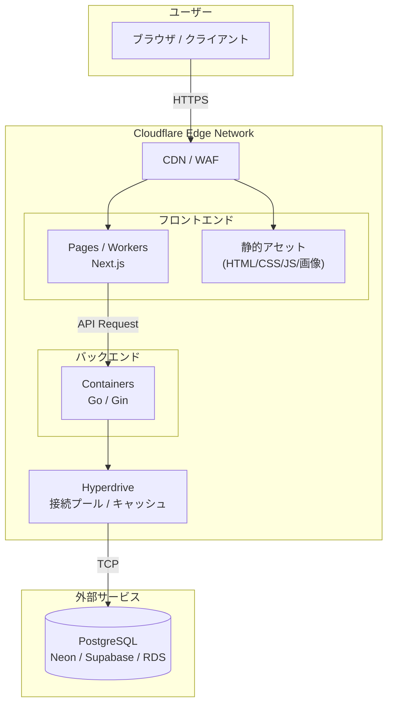
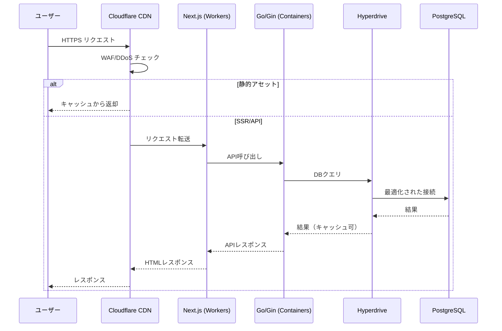
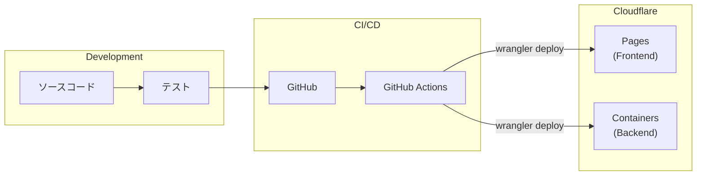

## 1. 概要

### 1.1 目的

本ドキュメントは、Cloudflareプラットフォームを活用したWebアプリケーションのインフラ構成について定義する。

### 1.2 システム概要

- **フロントエンド**: Next.js によるSSR/SSG対応Webアプリケーション
- **バックエンド**: Go (Gin) によるREST APIサーバー
- **データベース**: PostgreSQL

### 1.3 設計方針

| 方針 | 説明 |
|------|------|
| エッジコンピューティング | Cloudflareのグローバルネットワークを活用し、低レイテンシを実現 |
| サーバーレス | インフラ管理の負荷を最小化 |
| スケールtoゼロ | 使用していない時間は課金されない従量課金モデル |
| グローバル展開 | 単一デプロイで世界中にサービス提供 |

---

## 3. システム構成図



---

## 4. 使用サービス一覧

| レイヤー | サービス | 用途 | 備考 |
|----------|----------|------|------|
| CDN/セキュリティ | Cloudflare CDN | コンテンツ配信、DDoS対策 | 自動適用 |
| フロントエンド | Cloudflare Pages / Workers | Next.js ホスティング | SSR/SSG対応 |
| バックエンド | Cloudflare Containers | Go/Gin APIサーバー | Beta版 |
| DB接続 | Cloudflare Hyperdrive | PostgreSQL接続最適化 | コネクションプーリング |
| データベース | Neon / Supabase / AWS RDS | PostgreSQL | 外部サービス |

---

## 5. コンポーネント詳細

### 5.1 フロントエンド（Next.js）

#### 実行環境

| 項目 | 仕様 |
|------|------|
| プラットフォーム | Cloudflare Pages / Workers |
| フレームワーク | Next.js |
| レンダリング | SSR / SSG / ISR |
| デプロイ方式 | Git連携 または Wrangler CLI |

#### リソース制限

| 項目 | 制限値 |
|------|--------|
| リクエスト | 1,000万/月（Paid Plan含む） |
| CPU時間 | 30ms/リクエスト（最大5分） |
| メモリ | 128MB |
| 静的アセット | 無制限 |

#### 主要機能

- サーバーサイドレンダリング（SSR）
- 静的サイト生成（SSG）
- API Routes（軽量処理のみ）
- 画像最適化
- エッジキャッシュ

### 5.2 バックエンド（Go/Gin）

#### 実行環境

| 項目 | 仕様 |
|------|------|
| プラットフォーム | Cloudflare Containers |
| 言語 | Go |
| フレームワーク | Gin |
| コンテナ形式 | Docker (linux/amd64) |
| デプロイ方式 | Wrangler CLI |

#### インスタンスタイプ

| タイプ | vCPU | メモリ | ディスク | 推奨用途 |
|--------|------|--------|----------|----------|
| lite | 1/16 | 256 MiB | 2 GB | 開発・テスト |
| basic | 1/4 | 1 GiB | 4 GB | 小規模本番 |
| standard-1 | 1/2 | 4 GiB | 8 GB | 中規模本番 |
| standard-2 | 1 | 6 GiB | 12 GB | 大規模本番 |
| standard-3 | 2 | 8 GiB | 16 GB | 高負荷処理 |
| standard-4 | 4 | 12 GiB | 20 GB | 最大性能 |

#### 推奨インスタンス構成

| 環境 | インスタンスタイプ | 最大インスタンス数 |
|------|-------------------|-------------------|
| 開発 | lite | 1 |
| ステージング | basic | 2 |
| 本番 | standard-1 | 5 |

#### 制約事項

| 項目 | 内容 |
|------|------|
| ディスク | 揮発性（スリープ後リセット） |
| コールドスタート | 2〜3秒程度 |
| スリープタイムアウト | 設定可能（デフォルト10分） |
| アーキテクチャ | linux/amd64 のみ |

### 5.3 データベース接続（Hyperdrive）

#### 機能

| 機能 | 説明 |
|------|------|
| コネクションプーリング | DB接続数を最適化 |
| クエリキャッシュ | 読み取りクエリの高速化 |
| グローバル分散 | エッジからの低レイテンシ接続 |

#### 設定パラメータ

```toml
# wrangler.toml 設定例
[[hyperdrive]]
binding = "DB"
id = "<hyperdrive-config-id>"
```

### 5.4 データベース（PostgreSQL）

#### 推奨外部サービス

| サービス | 特徴 | 無料枠 | 有料プラン |
|----------|------|--------|-----------|
| Neon | サーバーレス、オートスケール | 0.5GB, 190時間/月 | $19/月〜 |
| Supabase | PostgreSQL + 認証/API | 500MB | $25/月〜 |
| AWS RDS | 高い安定性、既存AWS連携 | なし | $15/月〜 |

#### 接続設定

| 項目 | 値 |
|------|-----|
| プロトコル | PostgreSQL (TCP) |
| ポート | 5432（標準） |
| SSL | 必須 |
| 接続方式 | Hyperdrive経由 |

---

## 6. ネットワーク構成

### 6.1 通信フロー



### 6.2 エンドポイント設計

| エンドポイント | 用途 | 処理先 |
|----------------|------|--------|
| `/*` | フロントエンド | Pages/Workers |
| `/_next/static/*` | 静的アセット | CDNキャッシュ |
| `/api/*` | バックエンドAPI | Containers |

### 6.3 DNS設定

| レコード | タイプ | 値 | Proxy |
|----------|--------|-----|-------|
| @ | CNAME | `<project>.pages.dev` | ON |
| www | CNAME | `<project>.pages.dev` | ON |
| api | CNAME | `<worker>.workers.dev` | ON |

---

## 7. セキュリティ

### 7.1 通信セキュリティ

| 項目 | 対策 |
|------|------|
| HTTPS | Cloudflare自動SSL/TLS（強制） |
| TLSバージョン | TLS 1.2以上 |
| HSTS | 有効化推奨 |

### 7.2 アプリケーションセキュリティ

| 項目 | 対策 |
|------|------|
| DDoS対策 | Cloudflare標準機能 |
| WAF | Cloudflareマネージドルール |
| Bot対策 | Bot Management（オプション） |
| Rate Limiting | Workers Rate Limiting |

### 7.3 データベースセキュリティ

| 項目 | 対策 |
|------|------|
| 接続暗号化 | SSL必須 |
| 認証 | データベースユーザー認証 |
| IP制限 | Hyperdrive経由のみ許可 |
| シークレット管理 | Cloudflare Secrets |

### 7.4 シークレット管理

```bash
# シークレット設定コマンド
wrangler secret put DATABASE_URL
wrangler secret put API_SECRET_KEY
```

---

## 8. 監視・ログ

### 8.1 標準監視項目

| 項目 | ツール | 保持期間 |
|------|--------|----------|
| Workersメトリクス | Cloudflare Dashboard | 30日 |
| Containersメトリクス | Cloudflare Dashboard | 30日 |
| リクエストログ | Workers Logs | 7日（Paid） |
| エラーログ | Workers Logs | 7日（Paid） |

### 8.2 アラート設定（推奨）

| 条件 | 閾値 | アクション |
|------|------|------------|
| エラー率 | > 1% | メール通知 |
| レイテンシ | > 3秒 | メール通知 |
| CPU使用率 | > 80% | スケール検討 |

---

## 9. デプロイメント

### 9.1 デプロイフロー



### 9.2 デプロイコマンド

```bash
# フロントエンドデプロイ
npm run build
wrangler pages deploy ./out

# バックエンドデプロイ
wrangler deploy
```

### 9.3 環境分離

| 環境 | ブランチ | URL |
|------|----------|-----|
| 開発 | develop | `dev.<project>.pages.dev` |
| ステージング | staging | `staging.<project>.pages.dev` |
| 本番 | main | `<custom-domain>` |

---

## 10. 料金見積もり

### 10.1 Cloudflare料金

#### 固定費

| 項目 | 月額 |
|------|------|
| Workers Paid Plan | $5 |

#### 従量課金（無料枠超過時）

| サービス | 無料枠 | 超過料金 |
|----------|--------|----------|
| Workers リクエスト | 1,000万/月 | $0.30/100万 |
| Workers CPU | 3,000万ms/月 | $0.02/100万ms |
| Containers メモリ | 25 GiB時間/月 | $0.0000025/GiB秒 |
| Containers CPU | 375 vCPU分/月 | $0.000020/vCPU秒 |
| Containers ディスク | 200 GB時間/月 | $0.00000007/GB秒 |
| Hyperdrive | 無制限 | $0（Paid含む） |
| Egress（日本） | 500 GB/月 | $0.04/GB |

### 10.2 PostgreSQL料金（外部）

| サービス | プラン | 月額 |
|----------|--------|------|
| Neon | Free | $0 |
| Neon | Launch | $19 |
| Supabase | Free | $0 |
| Supabase | Pro | $25 |

### 10.3 月額料金シミュレーション

#### 小規模（〜10万リクエスト/月）

| 項目 | 料金 |
|------|------|
| Cloudflare Workers Paid | $5 |
| Containers | $0（無料枠内） |
| PostgreSQL（Neon Free） | $0 |
| **合計** | **$5/月** |

#### 中規模（〜500万リクエスト/月）

| 項目 | 料金 |
|------|------|
| Cloudflare Workers Paid | $5 |
| Containers（basic, 8h/日） | $5〜10 |
| PostgreSQL（Neon Launch） | $19 |
| **合計** | **$30〜35/月** |

#### 大規模（〜5,000万リクエスト/月）

| 項目 | 料金 |
|------|------|
| Cloudflare Workers Paid | $5 |
| Workers 超過分 | $12 |
| Containers（standard-1, 24h） | $50〜70 |
| PostgreSQL（Neon Scale） | $69 |
| **合計** | **$140〜160/月** |

---

## 11. 制約事項・注意点

### 11.1 Cloudflare Containers（Beta）

| 項目 | 内容 |
|------|------|
| ステータス | パブリックベータ（2025年6月〜） |
| SLA | ベータ期間中はSLAなし |
| 永続ディスク | 非対応（揮発性のみ） |
| 最大リソース | 40 vCPU / 40 GiB メモリ（アカウント合計） |

### 11.2 運用上の注意

| 項目 | 対策 |
|------|------|
| コールドスタート | ウォームアップ処理の実装 |
| ステートレス設計 | セッションはDB/外部ストアに保存 |
| ログ保持 | 長期保存が必要な場合は外部転送 |

---

## 12. 改訂履歴

| バージョン | 日付 | 変更内容 | 担当者 |
|------------|------|----------|--------|
| 1.0 | 2025/12/29 | 初版作成 | - |

---

## 付録

### A. 参考リンク

- [Cloudflare Workers ドキュメント](https://developers.cloudflare.com/workers/)
- [Cloudflare Pages ドキュメント](https://developers.cloudflare.com/pages/)
- [Cloudflare Containers ドキュメント](https://developers.cloudflare.com/containers/)
- [Cloudflare Hyperdrive ドキュメント](https://developers.cloudflare.com/hyperdrive/)
- [Neon ドキュメント](https://neon.tech/docs)

### B. 用語集

| 用語 | 説明 |
|------|------|
| Workers | Cloudflareのサーバーレス実行環境 |
| Pages | 静的サイト・フルスタックホスティング |
| Containers | Dockerコンテナ実行環境 |
| Hyperdrive | データベース接続最適化サービス |
| Wrangler | Cloudflare CLI ツール |
| SSR | サーバーサイドレンダリング |
| SSG | 静的サイト生成 |